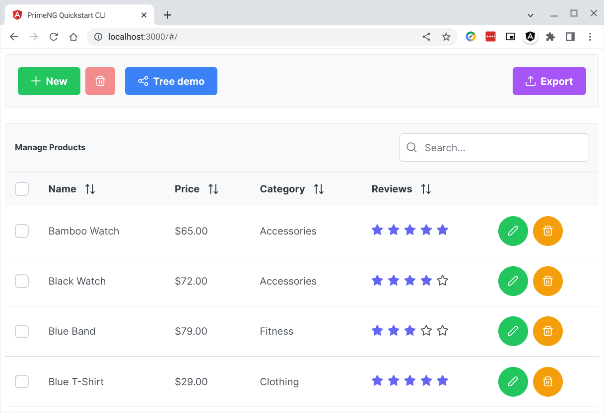
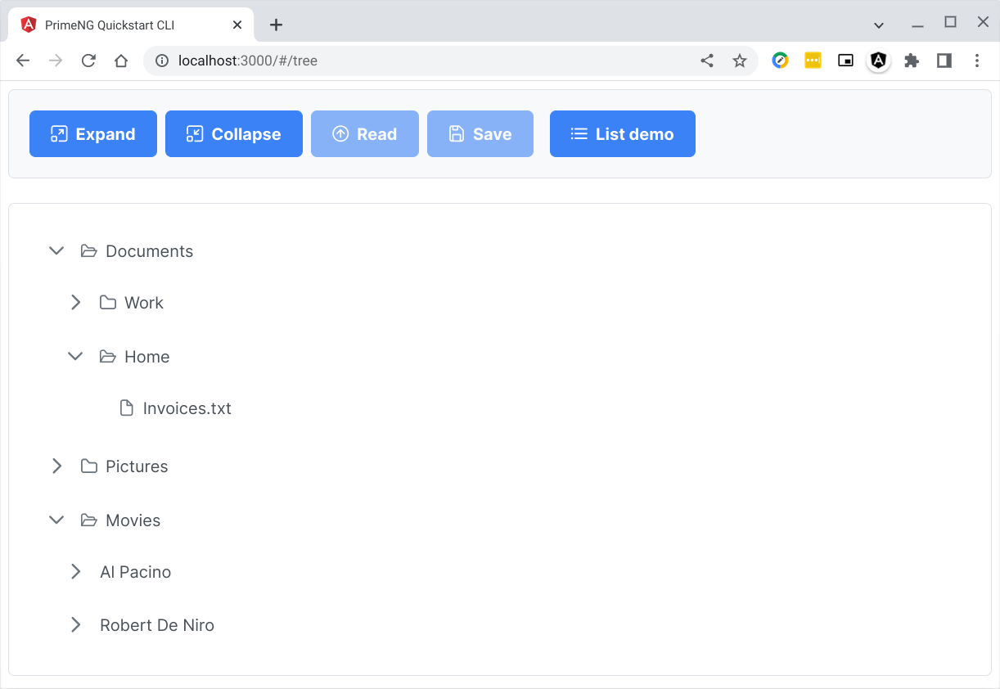

# go-static-server

## Write a Go static file web server

> ***This tutorial requires some knowledge in Linux, Angular, and Go Programming Language.***

## Table of Contents
1. Introduction
2. Why Go
3. Install Go
4. Clone this repo
5. Demo code #1
6. Demo code #2

## 1. Introduction

In the early stage of our Angular webapp dev programming, a static web server can be a stand-in for a webapp server. As we work on our UI we can feed our components static data just to get a feel for the overall UI design experience.

Angular has a development web server but I like to use a static server. This static server evolves eventually into the server-side app as I add controllers into it. Once we have the UI design settled we can feed our components data from the database through our webapp server APIs.

In this tutorial we will write 2 versions of a simple static web server. The 1st version is a simple-as-possible static web server in Go. We will write it in about 10 lines of code just for demo purposes. The 2nd version will be the base code of the next iteration of our webapp server.

In this tutorial we do not have Angular sourcecode in the ***src/client*** folder. Instead what we have is the compiled version, from the previous tutorial, in the ***src/client/dist-static*** folder. I have a ***.gitignore*** rule to block the ***dist*** folder so I had to rename to ***dist-static***.

## 2. Why Go

This is not the venue for any comparative analysis on the merits of Go over any other language. I like them all. I happen to have simply chosen Go (as well as Angular, and Postgresql) as key pieces for my own projects.

I like that Go generates a stand-alone executable without the need for separate external bulky confusing libraries. And it compiles really fast, instantly in seconds. Deploying a Go executable is simply a one-file copy-and-paste or a quick ***scp*** file copy. With Go you can easily cross-compile to another CPU/OS combination.

The Go language main website is [Go.dev](https://go.dev/). The [Go wiki](https://github.com/golang/go/wiki) has a page titled [Why Go](https://github.com/golang/go/wiki/whygo). Here is a wiki page on [Go Users](https://github.com/golang/go/wiki/GoUsers). Here is another that discusses [moving a code base to Go](https://github.com/golang/go/wiki/FromXToGo) from some other language. And here is a page on Go [success stories](https://github.com/golang/go/wiki/SuccessStories) from around the web.

One of the first implementation of [Ethereum is in Go](https://geth.ethereum.org/). Go is also the preferred language for [Blockchain](https://medium.com/@pkthakur01/why-golang-for-blockchain-40f874f2ce1b). The Cloud Native Computing Foundation [CNCF](https://www.cncf.io/), which is part of the [Linux Foundatioin](https://linuxfoundation.org/), has the mission to make cloud native computing ubiquitous. CNCF projects are [predominantly written](https://sdtimes.com/softwaredev/go-the-language-of-cloud-native-development/) in the Go language.

[Docker](https://www.docker.com/) and its toolset (swarm, engine, compose, and etc.) are all written in Go and so are [Kubernetes](https://kubernetes.io/), [Rclone](https://rclone.org/), [Syncthing](https://syncthing.net/), [gocryptfs](https://nuetzlich.net/gocryptfs/), [Hugo](https://gohugo.io/), [etcd](https://etcd.io/), [CockroachDB](https://www.cockroachlabs.com/), [LXD](https://linuxcontainers.org/lxd/), [RQLite](https://github.com/rqlite/rqlite), [Dqlite](https://dqlite.io/), [Litestream](https://litestream.io/), and many more. The reference code for [gRPC](https://grpc.io/) and [Raft](https://raft.github.io/) Consensus Algorithm are in Go.

The Chrome [download](https://www.google.com/chrome/downloads/) website runs Go as told by these [slides](https://talks.golang.org/2013/oscon-dl.slide#1). When you order online from Walmart or Target, you are browsing Go websites. Or when you browse Uber,Lyft, or Airbnb, these companies are Go users. Go software is [everywhere now](https://github.com/avelino/awesome-go).

I do admit that the moment I checked out Go, I was instantly hooked. It was a much needed breath of fresh air compared to my day job. OOP inheritance to the nth-level was becoming ugly. Go's take on polymorphism is refreshing. It's built-in concurrency features are awesome. I like Go's simple error handling. Up to now (Go 1.18), Go has only [25 keywords](https://go101.org/article/keywords-and-identifiers.html). Frankly this talk on [Simplicity is Complicated](https://www.programmingtalks.org/talk/dotgo-2015-rob-pike-simplicity-is-complicated) by Rob Pike won me over. For webapp programming Go is perfect. The Go standard library is all I need.

These days I am also learning [Cobra](https://cobra.dev/), for a cleaner cli interface, and [Hugo](https://gohugo.io/), a static site generator. I am also reading O’Reilly's [TensorFlow.js book](https://www.ebooks.com/en-us/book/detail/210286340/). ML will permeate all over IT. I am glad to learn at [I/O 2022](https://blog.angular.io/angular-at-i-o-2022-b0db02c9b596) that Angular has [partnership](https://www.youtube.com/watch?v=df_QYkxfnfA) with [TensorFlow.js](https://www.tensorflow.org/js).

## 3. Install Go

Installing Go is straightforward. It is a quick download and then expand the tar.gz file. It can take less than 60 seconds depending on your download speed. Follow the following steps.

3\.1\. Download Go into your ***~/Downloads*** folder. Using your browser, download Go from the website: [https://go.dev/dl/](https://go.dev/dl/)

3\.2\. In your terminal go into your download folder by typing ***cd ~/Downloads*** and then confirm that it is in the folder by typing ***ll go\****

```bash
user1@penguin:~$
:cd ~/Downloads

user1@penguin:~/Downloads$
:ll go*
-rw-r--r-- 1 user1 user1 141812725 Jul 21 16:31 go1.18.4.linux-amd64.tar.gz
```

3\.3\. Issue the command: ***sudo rm -rf /usr/local/go && sudo tar -C /usr/local -xzf go1.18.4.linux-amd64.tar.gz***

**Note** that this command differs from Google's installation [instruction here](https://go.dev/doc/install) where the ***rm*** and ***tar*** commands are not prefixed with ***sudo***. The folder ***/usr/local*** is usually owned by the ***root*** account. You will not be able to write into this ***/usr/local*** folder unless you prefix your command with ***sudo*** to obtain ***root*** rights for the life of the command. You must be a member of the ***sudo*** group to use ***sudo***.

This command is actually 2 commands concatenated by ***&&*** symbol. The first command ***rm -rf*** can be <ins>**very dangerous**</ins> when prefixed by the ***sudo*** command. <ins>**It can completely obliterate whatever folder you pass to it! So be very careful.**</ins> The command ***rm -rf*** is used to clear the ***/usr/local/go*** folder. Simply overwriting into it with a new copy without clearing this folder can create problems in running Go.

To be safe you can copy the the whole command string using ***ctrl-c*** then paste into the terminal using ***ctrl-shift-v***. The second command ***tar*** unzips the downloaded file into the ***/usr/local*** folder.

```bash
user1@penguin:~/Downloads$
:sudo rm -rf /usr/local/go && sudo tar -C /usr/local -xzf go1.18.4.linux-amd64.tar.gz
```

3\.4\. Make sure that, in your ***~/.bashrc*** file, the Go compiler folder ***/usr/local/go/bin*** is in your ***PATH*** system variable. You can also include the folder ***~/go/bin*** as this will be, by default, where Go will save executables from compiling your code with ***go install*** command.

```bash
export PATH=$PATH:/usr/local/go/bin:~/go/bin
```

3\.5\. After updating your ***PATH***, then reload your ***~/.bashrc*** file with the command: ***source ~/.bashrc***. Then confirm that the installation worked by typing ***go version***.

```bash
:source ~/.bashrc

:go version
go version go1.18.4 linux/amd64
```

## 4. Clone this repo

In your chosen folder ***git clone*** this repo then ***cd go-static-server*** into the folder created. In the example below I am in my ***~/Projects*** folder. Follow the steps below. <ins>***You will have to substitute your folder here.***</ins>

```bash
user1@penguin:~/Projects$
:git clone https://github.com/cydriclopez/go-static-server.git

user1@penguin:~/Projects$
:cd go-static-server/src

user1@penguin:~/Projects/go-static-server/src$
:ll
drwxr-xr-x 1 user1 user1 22 Jul 21 11:20 client
drwxr-xr-x 1 user1 user1 18 Jul 11 20:01 pgsql
drwxr-xr-x 1 user1 user1 46 Jul 22 11:59 server

user1@penguin:~/Projects/go-static-server/src$
:ll client/dist-static
drwxr-xr-x 1 user1 user1 782 Jul  6 16:02 primeng-quickstart-cli

user1@penguin:~/Projects/go-static-server/src$
:ll server
-rw-r--r-- 1 user1 user1  343 Jul 22 12:50 main.go
-rw-r--r-- 1 user1 user1   83 Jul 13 10:20 README.md
-rw-r--r-- 1 user1 user1 1803 Jul 24 20:38 stic.go
```

Inside the ***src/client*** there is no Angular source code. What we have is a compiled version of the previous tutorial in ***src/client/dist-static*** folder, as shown above, is the folder ***primeng-quickstart-cli***. This folder was generated by the Angular compiler using the ***ng build*** command. We will use this folder as the parameter for our static server. We will serve the contents in this folder in our browser.

Also as shown above, the folder ***src/server*** contains 2 go files: ***main.go*** and ***stic.go***.

## 5. Demo code #1

5\.1\. Below is the listing of the ***main.go*** file. This is the most basic static file web server. Note that in the listing below the ***folder*** variable contains a string that is a relative path to our static folder ***../client/dist-static/primeng-quickstart-cli/***.

```go
package main

// Simple static server of Angular compiled dist/project folder.
import (
    "log"
    "net/http"
)

func main() {
    folder := "../client/dist-static/primeng-quickstart-cli/"
    http.Handle("/", http.FileServer(http.Dir(folder)))
    log.Fatal(http.ListenAndServe(":3000", nil))
}
```

5\.2\. Now that we already have a running Go compiler, we can compile ***main.go***. Follow the steps below. <ins>***You may have to substitute your folder here.***</ins>

```bash
user1@penguin:~/Projects/go-static-server/src$
:cd server

user1@penguin:~/Projects/go-static-server/src/server$
:ll
-rw-r--r-- 1 user1 user1  343 Jul 22 12:50 main.go
-rw-r--r-- 1 user1 user1   83 Jul 13 10:20 README.md
-rw-r--r-- 1 user1 user1 1803 Jul 24 20:38 stic.go

user1@penguin:~/Projects/go-static-server/src/server$
:go install main.go

user1@penguin:~/Projects/go-static-server/src/server$
:main
```

5\.3\. Note that earlier in ***3.4.*** we added the folder ***~/go/bin*** into our PATH. As a result we can now run ***main*** because the result of ***go install main.go*** is an executable file ***main*** in the folder ***~/go/bin*** which is now in our PATH.

So, after running the executable ***main***, here at this point we can open ***localhost:3000*** in our browser.<br/>


To exit out of the server app, go back to your terminal then press ***ctrl-c***.

```bash
user1@penguin:~/Projects/go-static-server/src/server$
:main
^C

user1@penguin:~/Projects/go-static-server/src/server$
:
```

## 6. Demo code #2

6\.1\. Below is the listing of the ***stic.go*** file. This is a bit more improved version of our basic static file web server.

So here is our demo code #2. We will eventually tweak this code to accommodate our controllers by which our Angular code can interact with. It is quite basic for a static server but it does the job.

```go
package main

// Simple static server of Angular compiled dist/project folder.
// A bit improved version.
import (
	"log"
	"net/http"
	"os"
	"os/signal"
	"syscall"
)

func main() {

	folder := ""
	port := "3000"	// Default port
	paramCount := len(os.Args)

	if paramCount == 1 {
		// Nothing to do no folder & port are given
		log.Fatal(`
Simple static server of Angular compiled dist/project folder.
Run "ng build --watch" then in another terminal
use dist/project folder as parameter for this utility.
Usage: stic STATIC_FOLDER_TO_SERVE [PORT_NUMBER]
Default port number: 3000
Examples:
stic .
stic ~/Projects/ng/ultima12/dist/ultima
stic ~/Projects/ng/ultima12/dist/ultima 4000`)

	} else if paramCount > 2 {
		// Folder & port are given so use them
		folder = os.Args[1]
		port = os.Args[2]

	} else {
		// Only folder is given use default port
		folder = os.Args[1]
	}

	if _, err := os.Stat(folder); os.IsNotExist(err) {
		log.Fatal("Folder does not exist.")
	}

	// Serve static folder
	http.Handle("/", http.FileServer(http.Dir(folder)))
	log.Printf("\nServing static folder: %s\nListening on port: %s\nPress Ctrl-C to stop server\n", folder, port)

	// Catch the Ctrl-C and SIGTERM from kill command
	ch := make(chan os.Signal, 1)
	signal.Notify(ch, os.Interrupt, os.Kill, syscall.SIGTERM)

	go func() {
		signalType := <-ch
		signal.Stop(ch)
		log.Println("Exit command received. Exiting...")
		log.Println("Terminate signal type: ", signalType)

		//*********************************************
		// Note: here call your app Close() method to
		// properly close resources before exiting.
		//*********************************************

		os.Exit(0)
	}()

	port = ":" + port
	if err := http.ListenAndServe(port, nil); err != nil {
		log.Fatal("Http server fatal panic error: ", err)
	}
}
```

6\.2\. Next we can compile with ***go install stic.go***. Follow the steps below. <ins>***You may have to substitute your folder here.***</ins>

Compiling the static web server with ***go install stic.go***.

```bash
user1@penguin:~/Projects/go-static-server/src/server$
:go install stic.go
```

Running our ***stic*** static server without parameters.

```bash
user1@penguin:~/Projects/go-static-server/src/server$
:stic

2022/07/27 21:21:33
Utility web server program to serve a static folder.
For serving Angular "ng build --watch" dist/project folder.
Usage: stic STATIC_FOLDER_TO_SERVE [PORT_NUMBER]
Default port number: 3000
Examples:
stic ~/Projects/ng/ultima12/dist/ultima
stic ~/Projects/ng/ultima12/dist/ultima 4000
```

Running our static server ***stic ../client/dist-static/primeng-quickstart-cli*** with our static folder from the previous tutorial.

```bash
user1@penguin:~/Projects/go-static-server/src/server$
:stic ../client/dist-static/primeng-quickstart-cli

2022/07/25 16:36:02
Serving static folder: ../client/dist-static/primeng-quickstart-cli
Listening on port: 3000
Press Ctrl-C to stop server
```

Or we could have changed folder, with ***cd ../client/dist-static/primeng-quickstart-cli***, into the folder we want to serve. From this current folder, signified by a period ".", we can then serve it by typing "stic .".

Any which way is fine when running our static web server.

```bash
user1@penguin:~/Projects/go-static-server/src/server$
:cd ../client/dist-static/primeng-quickstart-cli

user1@penguin:~/Projects/go-static-server/src/client/dist-static/primeng-quickstart-cli$
:stic .

2022/07/27 21:51:47
Serving static folder: .
Listening on port: 3000
Press Ctrl-C to stop server
```

We can then open ***localhost:3000*** in our browser. Here I clicked on ***Tree demo*** to show the ***Tree demo*** page.<br/>


To exit out of the server app, go back to your terminal then press ***ctrl-c***.

```bash
:stic ../client/dist-static/primeng-quickstart-cli
2022/07/25 16:36:02
Serving static folder: ../client/dist-static/primeng-quickstart-cli
Listening on port: 3000
Press Ctrl-C to stop server

^C2022/07/25 16:54:11 Exit command received. Exiting...
2022/07/25 16:54:11 Terminate signal type:  interrupt

user1@penguin:~/Projects/go-static-server/src/server$
:
```

You can now use this utility program to serve your static files. A simple utility like this is production grade thanks to Go's speed and concurrency. Go's standard library is battle tested with popular use all over the web.

I hope this has been helpful. I hope I got to share with you that a Go static server is a useful base for the eventual development into our webapp server.

Happy coding! 😊

---
